# Gemini CLI 架构深度分析

## 目录 (Table of Contents)

1. [架构概览 (Architecture Overview)](#架构概览-architecture-overview)
2. [工作流程 (Workflow)](#工作流程-workflow)
3. [核心模块深度分析 (Core Module Analysis)](#核心模块深度分析-core-module-analysis)
   - 3.1 [Core 包整体架构](#31-core-包整体架构)
   - 3.2 [聊天会话管理 (GeminiChat)](#32-聊天会话管理-geminichat)
   - 3.3 [内容生成器 (ContentGenerator)](#33-内容生成器-contentgenerator)
   - 3.4 [对话轮次管理 (Turn)](#34-对话轮次管理-turn)
   - 3.5 [系统提示词管理 (Prompts)](#35-系统提示词管理-prompts)
4. [工具执行系统 (Tool Execution System)](#工具执行系统-tool-execution-system)
   - 4.1 [工具调度器架构](#41-工具调度器架构)
   - 4.2 [工具执行生命周期](#42-工具执行生命周期)
   - 4.3 [并发执行机制](#43-并发执行机制)
   - 4.4 [Turn 间的同步机制](#44-turn-间的同步机制)
5. [历史记录管理 (History Management)](#历史记录管理-history-management)
   - 5.1 [双历史机制设计](#51-双历史机制设计)
   - 5.2 [智能历史过滤](#52-智能历史过滤)
   - 5.3 [上下文渲染机制](#53-上下文渲染机制)
6. [工具系统详解 (Tool System)](#工具系统详解-tool-system)
   - 6.1 [工具框架架构](#61-工具框架架构)
   - 6.2 [工具分类和功能](#62-工具分类和功能)
   - 6.3 [安全机制](#63-安全机制)
7. [总结与思考 (Summary & Insights)](#总结与思考-summary--insights)

---

## 架构概览 (Architecture Overview)

### 整体架构设计

Gemini CLI 采用了模块化的分层架构，清晰地分离了用户界面、业务逻辑和 API 交互层：

```
┌─────────────────────────────────────────────────────┐
│                CLI Package                          │
│          (用户交互 & 流程控制)                        │
├─────────────────────────────────────────────────────┤
│                Core Package                         │
│           (业务逻辑 & API 管理)                      │
├─────────────────────────────────────────────────────┤
│                 Tool System                         │
│          (扩展能力 & 外部集成)                        │
└─────────────────────────────────────────────────────┘
```

### 核心架构组件

1. **CLI 包 (`packages/cli/`)** - 前端层
   - 处理用户交互界面
   - 主题系统 (多种主题如 dracula、github、ayu 等)
   - React 组件系统 (App.tsx、各种显示组件)
   - 命令处理器 (slash commands、shell commands、at commands)
   - 历史管理和输入处理

2. **Core 包 (`packages/core/`)** - 后端层
   - Gemini API 客户端
   - 工具注册和执行系统
   - 提示词管理
   - 会话状态管理
   - 遥测和日志系统

3. **工具系统 (`packages/core/src/tools/`)** - 扩展能力
   - 文件系统操作 (read、write、edit、glob、grep)
   - Shell 命令执行
   - Web 操作 (fetch、search)
   - MCP (Model Context Protocol) 客户端
   - 内存管理工具

### 技术栈

- **语言**: TypeScript
- **UI框架**: React (用于终端 UI)
- **运行时**: Node.js (>=18.0.0)
- **构建工具**: ESBuild
- **测试**: Vitest
- **包管理**: npm workspaces

### 关键设计特点

1. **前后端分离**: CLI 和 Core 独立开发，便于扩展
2. **工具插件化**: 可扩展的工具系统
3. **安全沙箱**: 支持 Docker/Podman 沙箱环境
4. **多认证方式**: OAuth2、API Key、Google Workspace
5. **实时流式响应**: 支持流式 API 响应显示

---

## 工作流程 (Workflow)

### 用户交互流程

```mermaid
flowchart TD
    %% 用户层
    A[👤 用户输入<br/>例如: "帮我修复这个bug"] --> B[🖥️ CLI 预处理<br/>解析命令类型]
    
    %% 命令分类处理
    B --> C{🔍 命令类型判断}
    C -->|/help, /theme| D[💻 本地处理<br/>直接在 CLI 执行]
    C -->|ls, git status| E[🐚 Shell工具<br/>执行系统命令]
    C -->|AI 对话| F[🤖 发送给 Gemini<br/>需要 AI 处理]
    
    %% AI 处理流程
    F --> G[⚙️ Core 处理<br/>构建 API 请求]
    G --> H[🔄 Turn 管理<br/>单次对话轮次]
    H --> I{🛠️ 需要工具调用?<br/>如读取文件、执行命令}
    
    %% 工具执行分支
    I -->|是| J[📋 工具调度器<br/>管理工具执行]
    I -->|否| K[💬 直接响应<br/>纯文本回答]
    
    %% 工具执行详情
    J --> L[⚡ 工具并发执行<br/>read_file + grep + ls]
    L --> M[📊 结果收集<br/>等待所有工具完成]
    M --> N[🔁 继续对话<br/>发送结果给 Gemini]
    N --> O[📺 显示最终结果]
    
    %% 其他分支汇总
    K --> O
    D --> O
    E --> O
    
    %% 样式定义
    classDef userStyle fill:#e1f5fe
    classDef cliStyle fill:#f3e5f5
    classDef aiStyle fill:#e8f5e8
    classDef toolStyle fill:#fff3e0
    classDef resultStyle fill:#fce4ec
    
    class A userStyle
    class B,D,E cliStyle
    class F,G,H,I,K,N aiStyle
    class J,L,M toolStyle
    class O resultStyle
```


### 详细工作流程示例

让我们通过一个具体例子来理解工作流程：

**用户输入**: "帮我找到项目中所有的 TODO 注释并修复第一个"

```mermaid
sequenceDiagram
    participant User as 👤 用户
    participant CLI as 🖥️ CLI层
    participant Core as ⚙️ Core层
    participant Gemini as 🤖 Gemini API
    participant Tools as 🛠️ 工具系统
    
    User->>CLI: "找到所有TODO并修复第一个"
    CLI->>Core: 转发用户请求
    Core->>Gemini: 发送请求 + 工具列表 + 历史
    
    Note over Gemini: AI 分析任务，决定需要的工具
    
    Gemini->>Core: 返回工具调用请求<br/>[grep搜索, read_file读取, edit修改]
    Core->>Tools: 调度工具执行
    
    par 并发执行工具
        Tools->>Tools: grep "TODO" **/*.js
        Tools->>Tools: read_file src/utils.js
        Tools->>Tools: (等待前面结果)
    end
    
    Tools->>Core: 返回所有工具结果
    Core->>Gemini: 发送工具执行结果
    
    Note over Gemini: 基于结果生成修复方案
    
    Gemini->>Core: 返回修复代码
    Core->>CLI: 转发响应
    CLI->>User: 显示结果 + 修复建议
```




### 系统内部处理流程

典型的对话交互遵循以下流程：

1. **用户输入**: 用户在终端输入提示或命令，由 `packages/cli` 管理
2. **请求预处理**: CLI 包将用户输入发送到 Core 包
3. **请求处理**: Core 包构建适当的提示，包含对话历史和可用工具定义，发送到 Gemini API
4. **Gemini API 响应**: API 处理提示并返回响应，可能是直接答案或工具调用请求
5. **工具执行**: 
   - 当 Gemini 请求工具时，Core 包准备执行
   - 对于可能修改文件系统或执行 shell 命令的工具，首先显示详情并要求用户批准
   - 只读操作可能不需要明确确认
   - 确认后，Core 包执行相关工具，结果返回给 Gemini API
6. **响应返回**: Core 包将最终响应发送回 CLI 包
7. **结果显示**: CLI 包在终端中格式化并显示响应

---

## 核心模块深度分析 (Core Module Analysis)

### 3.1 Core 包整体架构

Core 包采用分层架构设计，主要包含以下核心模块：

```
core/
├── core/           # 核心逻辑层
├── tools/          # 工具层
├── services/       # 服务层
├── utils/          # 工具类
├── config/         # 配置管理
└── telemetry/      # 遥测系统
```

**核心导出结构**:
- **核心逻辑**: client.js, geminiChat.js, contentGenerator.js, turn.js, prompts.js
- **工具系统**: tools.js, tool-registry.js 及各种具体工具实现
- **服务层**: fileDiscoveryService.js, gitService.js
- **工具类**: 错误处理、重试机制、路径处理等

### 3.2 聊天会话管理 (GeminiChat)

#### 核心职责
- 管理与 Gemini API 的会话状态
- 维护两种历史记录：精选历史（用于 API）和完整历史（包含无效响应）
- 处理流式和非流式响应
- 实现智能重试机制（429/5xx 错误）

#### 关键特性

**双历史记录机制**:
```typescript
class GeminiChat {
  private history: Content[] = [];  // 完整历史（comprehensive history）
  
  // 获取历史记录
  getHistory(curated: boolean = false): Content[] {
    const history = curated
      ? extractCuratedHistory(this.history)  // 精选历史
      : this.history;                         // 完整历史
    return structuredClone(history);
  }
}
```

**设计亮点**:
- 智能历史管理：自动过滤无效/空响应
- 思考内容分离：将模型的 "thought" 内容单独处理
- 相邻响应合并：避免消息碎片化
- Flash 模型降级机制：OAuth 用户速率限制时自动降级

#### 发送消息流程

```typescript
async sendMessage(params: SendMessageParameters): Promise<GenerateContentResponse> {
  const userContent = createUserContent(params.message);
  // 关键：获取精选历史并添加当前用户输入
  const requestContents = this.getHistory(true).concat(userContent);
  
  // 发送给 API，包含完整对话历史
  const response = await this.contentGenerator.generateContent({
    model: this.config.getModel(),
    contents: requestContents,
    config: { ...this.generationConfig, ...params.config },
  });
}
```

### 3.3 内容生成器 (ContentGenerator)

#### 核心职责
- 提供统一的内容生成接口
- 支持三种认证方式：OAuth、API Key、Vertex AI
- 根据认证类型动态选择模型

#### 架构设计

```typescript
interface ContentGenerator {
  generateContent(request: GenerateContentRequest): Promise<GenerateContentResponse>;
  generateContentStream(request: GenerateContentRequest): AsyncGenerator<...>;
  embedContent(params: EmbedContentParameters): Promise<...>;
}

// 工厂方法
async function createContentGenerator(config: ContentGeneratorConfig) {
  // 根据认证类型创建不同的生成器
}
```

**特色功能**:
- 动态模型选择基于认证方法
- 自定义 User-Agent 标头用于跟踪
- 支持环境变量配置不同认证方法

### 3.4 对话轮次管理 (Turn)

#### 核心职责
- 管理单个对话轮次的完整流程
- 流式处理模型响应
- 提取不同类型的事件

#### 事件类型系统

```typescript
type ServerGeminiStreamEvent = 
  | { type: 'content', content: string }
  | { type: 'thought', thought: { subject: string, description: string } }
  | { type: 'tool_call', toolCall: ToolCallRequestInfo }
  | { type: 'usage', usage: UsageMetadata }
  | { type: 'error', error: Error }
  | { type: 'done' }
```

#### 流处理机制

```typescript
class Turn {
  async *run(): AsyncGenerator<ServerGeminiStreamEvent> {
    // 1. 发送消息到 Gemini
    // 2. 流式接收响应
    // 3. 解析不同类型的内容
    // 4. 处理函数调用
    // 5. 生成相应事件
  }
}
```

**核心特性**:
- 思考内容解析（subject/description）
- 函数调用转换为工具请求
- 使用元数据跟踪和错误处理
- 支持用户取消操作

### 3.5 系统提示词管理 (Prompts)

#### 核心职责
- 生成定义 AI 助手行为的系统提示词
- 支持环境变量和外部文件覆盖
- 根据运行环境动态调整

#### 提示词结构

```typescript
function getCoreSystemPrompt(config: Config): string {
  return `
    # 核心指令
    - 遵循代码约定
    - 保持简洁风格
    - 主动但不过度
    
    # 主要工作流
    - 软件工程任务
    - 新应用创建
    
    # 可用工具
    ${工具列表}
    
    # 环境信息
    ${沙箱/Git/内存信息}
  `;
}
```

**动态适配特性**:
- 检测沙箱环境（macOS Seatbelt 或容器）
- 检测 Git 仓库状态
- 集成用户偏好和记忆
- 支持外部提示文件覆盖

---

## 工具执行系统 (Tool Execution System)

### 4.1 工具调度器架构

CoreToolScheduler 负责管理工具执行的完整生命周期，采用状态机设计模式：

#### 状态机设计

```
validating → awaiting_approval → scheduled → executing → success/error/cancelled
                    ↓
                rejected → cancelled
```

#### 核心类型定义

```typescript
export type ToolCall =
  | ValidatingToolCall      // 验证参数中
  | ScheduledToolCall       // 已调度
  | ErroredToolCall         // 执行错误
  | SuccessfulToolCall      // 执行成功
  | ExecutingToolCall       // 执行中
  | CancelledToolCall       // 已取消
  | WaitingToolCall;        // 等待确认
```

### 4.2 工具执行生命周期

#### 完整执行流程

```typescript
class CoreToolScheduler {
  async schedule(toolCalls: ToolCallRequestInfo[]) {
    // 1. 验证参数
    for (const toolCall of newToolCalls) {
      const confirmationDetails = await toolInstance.shouldConfirmExecute(
        reqInfo.args,
        signal,
      );
      
      // 2. 检查是否需要确认
      if (confirmationDetails) {
        this.setStatusInternal(reqInfo.callId, 'awaiting_approval', confirmationDetails);
      } else {
        this.setStatusInternal(reqInfo.callId, 'scheduled');
      }
    }
    
    // 3. 尝试执行已调度的工具
    this.attemptExecutionOfScheduledCalls(signal);
  }
}
```

#### 确认和修改机制

```typescript
async handleConfirmationResponse(
  callId: string,
  outcome: ToolConfirmationOutcome,
  signal: AbortSignal,
) {
  if (outcome === ToolConfirmationOutcome.ModifyWithEditor) {
    // 支持用户修改工具参数
    const { updatedParams, updatedDiff } = await modifyWithEditor(
      waitingToolCall.request.args,
      modifyContext,
      editorType,
      signal,
    );
    this.setArgsInternal(callId, updatedParams);
  }
}
```

### 4.3 并发执行机制

#### 真正的并发执行

CoreToolScheduler 实现了真正的并发执行，而不仅仅是异步：

```typescript
private attemptExecutionOfScheduledCalls(signal: AbortSignal): void {
  const callsToExecute = this.toolCalls.filter(
    (call) => call.status === 'scheduled',
  );

  // 使用 forEach 同时启动所有工具执行
  callsToExecute.forEach((toolCall) => {
    // 每个工具的 execute 返回 Promise，但不等待
    scheduledCall.tool
      .execute(scheduledCall.request.args, signal, liveOutputCallback)
      .then((toolResult: ToolResult) => {
        // 处理成功结果
      })
      .catch((executionError: Error) => {
        // 处理错误
      });
  });
}
```

#### 并发执行示例

```
时间线 →
T0: schedule([tool1, tool2, tool3])
    ↓
T1: 验证所有工具参数
    ↓
T2: 检查确认需求（可能并行）
    ↓
T3: attemptExecutionOfScheduledCalls()
    ├─→ tool1.execute() ─────→ [执行中...] ──→ 完成
    ├─→ tool2.execute() ──→ [执行中......] ────→ 完成
    └─→ tool3.execute() ───→ [执行中.] ──────→ 完成
                          ↑
                     所有工具并发执行
```

#### 并发控制特性

1. **防止重复调度**: 如果有工具正在运行，不允许新的调度
2. **实时状态更新**: 每个工具可独立提供实时输出
3. **错误隔离**: 一个工具失败不影响其他工具执行
4. **批量完成通知**: 等待所有工具完成后统一处理结果

### 4.4 Turn 间的同步机制

#### CLI 层控制的流程

**Turn 的启动和续接完全由 CLI 层控制**，Core 层提供无状态的服务：

```typescript
// CLI 层主动监听工具完成状态
useEffect(() => {
  const completedAndReadyToSubmitTools = toolCalls.filter(
    (toolCall) => {
      const isTerminal = 
        toolCall.status === 'success' ||
        toolCall.status === 'error' ||
        toolCall.status === 'cancelled';
      return isTerminal && !toolCall.responseSubmittedToGemini;
    }
  );

  // CLI 层决定何时启动下一个 Turn
  if (geminiTools.length > 0) {
    // CLI 主动调用 submitQuery 启动 Turn 2
    submitQuery(mergePartListUnions(responsesToSend), {
      isContinuation: true,  // 标记为续接
    });
  }
}, [toolCalls, isResponding, submitQuery]);
```

#### 等待机制说明

**是的，在进入 Turn 2 之前，系统会等待 Turn 1 中的所有工具执行完成**：

1. **Turn 1**: 接收用户输入 → 发送给 Gemini → 返回工具调用请求
2. **工具执行阶段**: UI 层通过 `useEffect` 监听工具状态 → 所有工具完成后自动触发新查询
3. **Turn 2**: 自动发送工具响应给 Gemini → 基于工具结果继续对话

#### 架构优势

1. **UI 响应性**: CLI 可以实时更新界面，不受 Core 层阻塞
2. **中断能力**: 用户可以随时取消，CLI 层处理中断逻辑
3. **扩展性**: 不同的前端可以有不同的流程控制
4. **测试性**: Core 层无状态，易于单元测试

---

## 历史记录管理 (History Management)

### 5.1 双历史机制设计

GeminiChat 维护两种类型的历史记录：

```typescript
class GeminiChat {
  private history: Content[] = [];  // 完整历史（comprehensive history）
  
  getHistory(curated: boolean = false): Content[] {
    const history = curated
      ? extractCuratedHistory(this.history)  // 精选历史
      : this.history;                         // 完整历史
    return structuredClone(history);
  }
}
```

**两种历史的作用**:
- **完整历史**: 包含所有对话，即使是无效或空响应，用于调试和审计
- **精选历史**: 只包含有效对话，用于发送给 API，确保上下文质量

### 5.2 智能历史过滤

#### extractCuratedHistory 函数的核心逻辑

这个函数实现了智能的历史记录过滤机制：

```typescript
function extractCuratedHistory(comprehensiveHistory: Content[]): Content[] {
  const curatedHistory: Content[] = [];
  let i = 0;

  while (i < comprehensiveHistory.length) {
    if (comprehensiveHistory[i].role === 'user') {
      // 用户消息总是被保留
      curatedHistory.push(comprehensiveHistory[i]);
      i++;
    } else {
      // 收集连续的模型响应
      const modelOutput: Content[] = [];
      let isValid = true;

      while (i < length && comprehensiveHistory[i].role === 'model') {
        modelOutput.push(comprehensiveHistory[i]);
        if (!isValidContent(comprehensiveHistory[i])) {
          isValid = false;
        }
        i++;
      }

      if (isValid) {
        curatedHistory.push(...modelOutput);
      } else {
        // 如果模型响应无效，移除前面的用户输入
        curatedHistory.pop();
      }
    }
  }
  return curatedHistory;
}
```

#### 智能过滤的关键设计

**为什么要删除前面的用户输入？**

这个设计基于一个重要原则：**对话必须是完整的用户-模型交互对**。

考虑以下场景：
```typescript
// 原始历史
[
  { role: 'user', parts: [{ text: '生成一张图片' }] },
  { role: 'model', parts: [] },  // 空响应（可能因为安全过滤）
  { role: 'user', parts: [{ text: '写一首诗' }] },
  { role: 'model', parts: [{ text: '春风又绿江南岸...' }] }
]

// 精选后的历史
[
  // 第一组被完全删除（因为模型响应无效）
  { role: 'user', parts: [{ text: '写一首诗' }] },
  { role: 'model', parts: [{ text: '春风又绿江南岸...' }] }
]
```

#### isValidContent 的判断标准

```typescript
function isValidContent(content: Content): boolean {
  if (content.parts === undefined || content.parts.length === 0) {
    return false;  // 没有内容部分
  }
  for (const part of content.parts) {
    if (part === undefined || Object.keys(part).length === 0) {
      return false;  // 空对象
    }
    if (!part.thought && part.text !== undefined && part.text === '') {
      return false;  // 空文本（除非是 thought）
    }
  }
  return true;
}
```

### 5.3 上下文渲染机制

#### 初始化时的上下文设置

```typescript
private async startChat(extraHistory?: Content[]): Promise<GeminiChat> {
  // 1. 获取环境信息
  const envParts = await this.getEnvironment();
  
  // 2. 创建初始历史
  const initialHistory: Content[] = [
    {
      role: 'user',
      parts: envParts,  // 包含日期、操作系统、工作目录、文件结构
    },
    {
      role: 'model',
      parts: [{ text: 'Got it. Thanks for the context!' }],
    },
  ];
  
  // 3. 添加系统提示词
  const systemInstruction = getCoreSystemPrompt(userMemory);
  
  // 4. 创建 GeminiChat 实例
  return new GeminiChat(
    this.config,
    this.getContentGenerator(),
    {
      systemInstruction,  // 系统级指令
      ...generateContentConfig,
      tools,             // 可用工具列表
    },
    history,            // 初始历史
  );
}
```

#### 完整的渲染流程

1. **初始化阶段**：
   - 系统提示词（systemInstruction）
   - 环境上下文（工作目录、文件结构等）
   - 初始的用户-模型交互

2. **每次发送消息**：
   - 获取精选历史（过滤无效响应）
   - 添加当前用户输入
   - 整个历史作为 `contents` 发送给 API

3. **历史更新**：
   - 记录用户输入和模型响应
   - 合并相邻的文本响应
   - 处理函数调用历史

---

## 工具系统详解 (Tool System)

### 6.1 工具框架架构

#### 工具基础接口

```typescript
interface Tool<TParams, TResult> {
  name: string;                    // 内部名称
  displayName: string;             // 显示名称
  description: string;             // 功能描述
  schema: FunctionDeclaration;     // API 模式
  isOutputMarkdown: boolean;       // 输出是否为 Markdown
  canUpdateOutput: boolean;        // 是否支持实时输出
  
  validateToolParams(params: TParams): string | null;
  shouldConfirmExecute(params: TParams): Promise<ToolCallConfirmationDetails | false>;
  execute(params: TParams, signal: AbortSignal): Promise<TResult>;
}
```

#### 工具注册机制

```typescript
export class ToolRegistry {
  private tools: Map<string, Tool> = new Map();
  
  // 注册工具
  registerTool(tool: Tool): void
  
  // 动态发现工具（通过命令或 MCP）
  async discoverTools(): Promise<void>
  
  // 获取所有工具声明
  getFunctionDeclarations(): FunctionDeclaration[]
}
```

### 6.2 工具分类和功能

#### 核心文件系统工具

1. **ReadFile Tool** (`read_file`)
   - **作用**: 读取指定文件的内容
   - **特性**: 支持文本、图片、PDF，分页支持大文件
   - **安全**: 路径限制在根目录内，遵循 .geminiignore

2. **ReadManyFiles Tool** (`read_many_files`)
   - **作用**: 批量读取多个文件，支持 glob 模式
   - **特性**: 默认排除构建目录，Git 感知过滤

3. **WriteFile Tool** (`write_file`)
   - **作用**: 写入内容到指定文件
   - **特性**: AI 内容校正，差异预览，需要用户确认

4. **Edit Tool** (`replace`)
   - **作用**: 在文件中替换文本（精确字符串匹配）
   - **特性**: AI 驱动的编辑校正，支持用户修改参数

#### 目录和搜索工具

5. **LS Tool** (`list_directory`)
   - **作用**: 列出指定目录的文件和子目录
   - **特性**: 文件元数据，排序输出

6. **Glob Tool** (`glob`)
   - **作用**: 查找匹配 glob 模式的文件
   - **特性**: 按修改时间排序，优先显示最近文件

7. **Grep Tool** (`search_file_content`)
   - **作用**: 在文件内容中搜索正则表达式
   - **特性**: 多策略搜索，自动错误处理

#### Shell 和外部工具

8. **Shell Tool** (`run_shell_command`)
   - **作用**: 执行 shell 命令并进行进程管理
   - **特性**: 跨平台支持，实时输出流，进程组管理

#### Web 和网络工具

9. **WebSearch Tool** (`google_web_search`)
   - **作用**: 通过 Gemini API 执行 Google 搜索
   - **特性**: 带有来源的基础元数据，引用标记

10. **WebFetch Tool** (`web_fetch`)
    - **作用**: 获取并通过 AI 分析 URL 内容
    - **特性**: 支持多 URL，私有 IP 检测，AI 内容处理

#### 专业工具

11. **Memory Tool** (`save_memory`)
    - **作用**: 将信息保存到长期记忆文件
    - **特性**: Markdown 格式，自动章节管理

12. **动态发现工具和 MCP 工具**
    - **作用**: 通过外部命令或 MCP 服务器发现的工具
    - **特性**: 动态注册，JSON schema 验证

### 6.3 安全机制

#### 多层安全保护

1. **路径验证**: 所有文件操作限制在根目录内
2. **Schema 验证**: 所有参数的 JSON Schema 验证  
3. **用户确认**: 破坏性操作需要用户批准
4. **私有网络检测**: WebFetch 检测和处理私有 IP
5. **进程管理**: Shell 工具提供适当的进程生命周期管理
6. **Git 感知**: 遵循 .gitignore 和 .geminiignore 模式
7. **内容校正**: AI 驱动的文件编辑验证

#### 确认系统

```typescript
// 多种确认类型
- 编辑确认: 显示文件修改差异
- 执行确认: 确认 shell 命令执行
- MCP 确认: 确认外部工具执行
- 信息确认: 一般信息对话框
```

#### 审批模式

- **手动**: 每个操作需要确认
- **自动编辑**: 自动批准文件操作  
- **基于白名单**: 记住用户决定

---

## 总结与思考 (Summary & Insights)

### 设计亮点

1. **模块化架构**: 清晰的职责分离，CLI 层负责交互控制，Core 层专注业务逻辑
2. **智能历史管理**: 双历史机制确保上下文质量的同时保留完整记录
3. **真正并发执行**: 工具调度器实现真正的并发，而非简单的异步
4. **流程控制分离**: CLI 层控制 Turn 流程，Core 层提供无状态服务
5. **安全第一**: 多层安全机制，用户确认系统，路径验证

### 架构优势

1. **可扩展性**: 
   - 插件化工具系统，易于添加新功能
   - MCP 协议支持，可集成外部服务
   - 模块化设计便于独立开发和测试

2. **用户体验**:
   - 实时流式响应，即时反馈
   - 智能历史过滤，提高对话质量
   - 并发工具执行，减少等待时间

3. **安全性**:
   - 沙箱环境支持
   - 用户确认机制
   - 路径和权限验证

4. **可维护性**:
   - TypeScript 类型安全
   - 清晰的接口定义
   - 完善的错误处理

### 扩展性分析

#### 当前架构支持的扩展方向

1. **新工具开发**: 
   - 基于 `BaseTool` 类快速开发
   - 标准化的确认和验证机制
   - 自动集成到工具注册表

2. **多前端支持**:
   - Core 包无状态设计，可支持多种前端
   - Web UI、IDE 插件、API 服务等

3. **外部集成**:
   - MCP 协议支持任意外部服务
   - 动态工具发现机制
   - 配置化的认证和权限管理

#### 潜在改进方向

1. **性能优化**:
   - 工具执行结果缓存
   - 增量文件读取
   - 更智能的历史压缩

2. **功能增强**:
   - 工具执行依赖管理
   - 更细粒度的权限控制
   - 工具执行回滚机制

3. **监控和调试**:
   - 更详细的遥测数据
   - 工具执行链跟踪
   - 性能指标监控

Gemini CLI 展现了现代 AI 辅助开发工具的设计精髓：在保持强大功能的同时，确保安全性、可扩展性和用户体验。其模块化架构和智能的工具执行系统为未来的 AI 开发工具提供了优秀的参考模型。